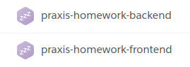
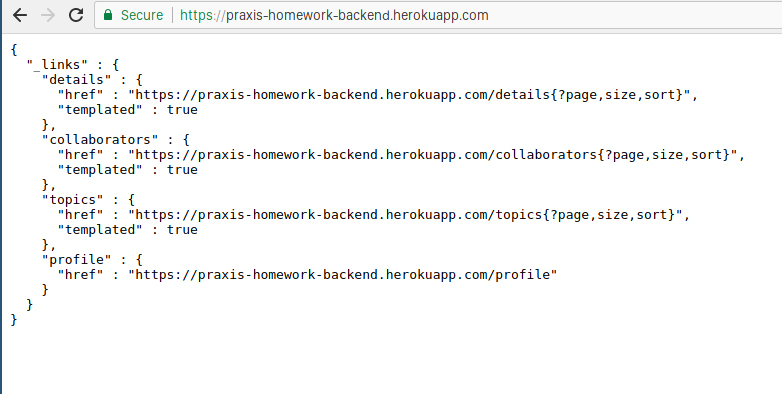
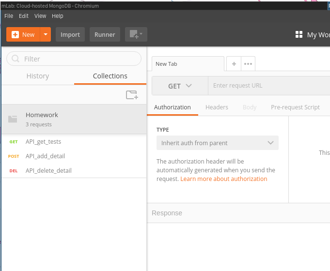

# Warning:
#### **Please follow the complete guide to evaluate the Homework and don't skip steps!!!!**


Table of contents
=================

<!--ts-->
* [Set Up](#set-up)
	* [Start The API](#start-the-api)
	* [Run The BackEnd Locally](#run-the-backend-locally)
	* [Run The FrontEnd Locally](#run-the-frontend-locally)
* [API tests](#api-tests)
* [UI tests](#ui-tests)
<!--te-->

SET UP
======

Before running the UI tests and the API tests verify that the API is online. This is because my heroku account is free, as soon as the API is not being used heroku turns it off.



So as you can see **praxis-home-backend** is off.

Start The API
--------------

To start the API you just need to go to your favorite browser and put the following URL:

   ```
https://praxis-homework-backend.herokuapp.com
 ```

It also works if you click [here](https://praxis-homework-backend.herokuapp.com)

After a while you will see something like this:



Or if you use firefox you'll get something like this


Now the API is set for testing.
    

Run the BackEnd Locally
======================
(Version of the backend by the date: 2018-04-01)
----------------------------------------------

Before starting clone the repo

```
git clone https://github.com/nbuitragob/homework_t8
```

Requirmetns:

```
    java 8
    maven
```

1. Taking *homework_t8* as the root go to the folder *BE_code*
	```
	/homework_t8
	└───/API_test
	└───/BE_code <- HERE
	└───/FE_code 
	└───/UI_test
	
	
    cd FE_code
 	```

2. Run the following command
    ```
    mvn package
    ```
    
    
    
3. you can start the API locally by executing this command:

	```
    java -jar target/topics-0.0.1-SNAPSHOT.jar 
    ```
  
    
  You can acces now though your browser using *localhost:8080* 
    
   

  Or if you use firefox you'll get something like this

   
    

Run the FrontEnd Locally
=========================
(Version of the frontend by the date: 2018-04-01)
-------------------------------------------------

Before starting clone the repo

```
git clone https://github.com/nbuitragob/homework_t8
```

Requirmetns:

```
nodejs
npm
angular/cli
```

1. Taking *homework_t8* as the root go to the folder *FE_code*
	```
	/homework_t8
	└───/API_test
	└───/BE_code
	└───/FE_code <- HERE
	└───/UI_test 
	
	

	cd FE_code
	```

2. Run the following command
    ```
    npm install
    ```
    
    
3. **if** you are sure that the heroku API (https://praxis-homework-backend.herokuapp.com) is running **then** you can start the frontend locally by executing this command:
    ```
    ng serve
    ```
  
    
  You can acces now though your browser using *localhost:4200* 
	
   


API tests
=========

In the folder *homework_t8/API_tests* you will have the following file:

```
Homework.postman_collection.json
```

That is a file created by postman in which all the API tests are described.

Now lets get started

1. Open your browser
2. Type *https://praxis-homework-backend.herokuapp.com* on your web borwser bar. This will turn on the backend and it should take a while since heroku needs to compile the backend.

	

3. Now open Postman (if you don't have Postman you can download it [here](https://www.getpostman.com/apps))
	
	
    
4. Close that first window, then click on file ("archivo" if you have postman in spanish) 

	
 	
5. Then click on import

	
    
6. Import *Homework.postman_collection.json* by clicking "Choose Files" and then selecting the file *Homework.postman_collection.json* from where you download it.
	
	
    
    
    
7. Now you should have something like this:

	
    
    Now lets run the tests!!!
    
8. Click on the button "Runner"
	
	
    
    A new window called "Collection Runner" should open
    
    

9. Here you will select the folder "Homework"

	
    
    After clicking "Homework" the field should change like this:
    
    
    
10. Now for the Environmet select "API_details_test"

	
    
11. Finally **if** you are sure that the heroku API (https://praxis-homework-backend.herokuapp.com) is running **then** click on "Run Homework" to run the test
	
    
    
12. You should get test results like these ones

	
    
Congratulation you have successfully run the API tests.


UI tests
========
For this you will need:

```
several terminals
nodejs
npm
```
        
1. Download the folder UI_test
2. Once Downloaded cd into it
	```
	cd UI_test
	```
3. Then open a terminal in this location and execute
	```
	npm install
	```
   
    
4. Using **two (2)** terminals and taking UI_test as the root directory of both terminal

	Run on one of them the following command:
    
    ```
    npm run start-webdriver
    ```
    
       
5. now **DO NOT** cancel the execution of the previous command and swich to the other terminal. 
    
  	Run the following command
   ```
    npm run protractor
    ```
With this command you are in fact running the UI test

   Please remmember that because of the licence I use in heroku (I don't pay a dime...) getting the frontend page for the first time could take a while.

   

   
    
Congratulation you succesfully run the UI tests

To ease the navigation through the folers this is the structure of the folder **UI_tests** 


```
/UI_tests
└───package.json
└───protractor.conf.js
└───env.js
│   │
└───/features
│   │
│   └───/steps
│   │   └───EP-268_steps.js
│   │
│   └───/pages
│   │   └───EP268_page.js
│   │
│   └───EP268.feature 
```

EP268 is the reference of the User Story of the project in *Mercurio*
    
    


